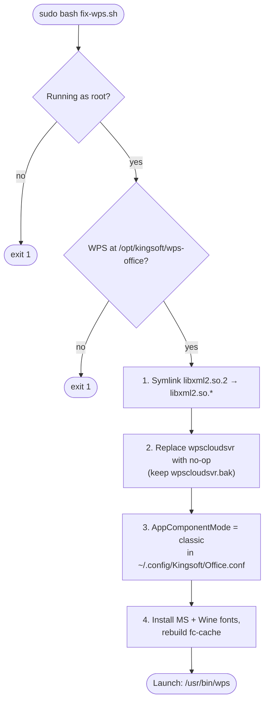

# wps-office-linux-fix

[](LICENSE)
[](fix-wps.sh)
[](#distro-compatibility)
[](https://www.wps.com/download)

> Get WPS Office 11.1.0 running again on modern Linux distros (Ubuntu 25.04+, Debian 13+) with a single idempotent script.

WPS Office's Linux desktop builds have effectively frozen on the 11.1.0 `.deb`. Its bundled libraries break against current system runtimes — the editor exits silently because it asks for `libxml2.so.2` while modern distros ship `libxml2.so.16`, and the cloud-sync daemon (`wpscloudsvr`) segfaults on launch and drags the main process down with it. This repository provides one shell script that patches all of that in place, plus the manual steps behind it for anyone who prefers to apply fixes by hand.

No source build. No fork of WPS. The fixes are external compatibility shims applied to the installed package.

## ✨ Features

- **One-command repair** — `sudo bash fix-wps.sh` walks every known breakage in sequence.
- **libxml2 compatibility shim** — symlinks `libxml2.so.2` to the system's current `libxml2.so.*`, restoring the loader dependency WPS expects.
- **Neutralizes the crashing cloud daemon** — backs up `wpscloudsvr` and replaces it with a no-op, so the segfaulting binary can no longer take the editor down.
- **Classic component mode** — switches `Office.conf` off the "fusion" dashboard that auto-spawns the daemon.
- **Microsoft fonts, installed automatically** — downloads the MS core web fonts via `cabextract`, and copies `Symbol`, `Wingdings`, and `Webdings` from a Wine install if one is present.
- **Idempotent and safe to re-run** — each step detects prior fixes and skips them; nothing is clobbered twice.
- **Drop-in for any x86-64 distro** — paths target `/usr/lib/x86_64-linux-gnu/` and `/opt/kingsoft/wps-office`, with no distro-specific assumptions beyond `apt` for one optional helper.
- **Fully reversible** — WPS itself is untouched; every change has a documented rollback.

## 📦 Installation

**Prerequisites:**

- An **x86-64** Linux system (the fix paths target `x86_64-linux-gnu`).
- **WPS Office 11.1.0** already installed from the official `.deb`:

```bash
sudo dpkg -i wps-office_11.1.0.*.amd64.deb
sudo apt install -f
```

- `sudo` access (the script refuses to run as a normal user).
- `curl`, `cabextract`, and `fontconfig` for the font step (`cabextract` is auto-installed via `apt` if missing).

**Get the fix:**

```bash
git clone https://github.com/<your-org-or-user>/wps-office-linux-fix.git
cd wps-office-linux-fix
```

## 🚀 Usage

Review the script first, then run it as root:

```bash
less fix-wps.sh
```

```bash
sudo bash fix-wps.sh
```

Expected output on a fresh system:

```text
[+] Checking libxml2...
[+] Linked /usr/lib/x86_64-linux-gnu/libxml2.so.16 -> /usr/lib/x86_64-linux-gnu/libxml2.so.2
[+] Disabling crashing wpscloudsvr...
[+] Replaced wpscloudsvr with no-op (backup at wpscloudsvr.bak)
[+] Switching to classic component mode...
[+] Set AppComponentMode=classic in /home/you/.config/Kingsoft/Office.conf
[+] Installing Microsoft core fonts...
[+] Installed 32 font files
[+] Rebuilding font cache...
[+] All fixes applied!

  Launch WPS: /usr/bin/wps
```

Launch the editor:

```bash
/usr/bin/wps
```

No silent exit, no `wpscloudsvr` crash, no formula-font warnings.

## 🧱 How it works

`fix-wps.sh` runs under `set -euo pipefail` and applies four idempotent patches to the installed WPS package. Each maps to a concrete failure mode:

| Step | What it changes | Problem solved |
|------|-----------------|----------------|
| 1. libxml2 shim | Symlinks `/usr/lib/x86_64-linux-gnu/libxml2.so.2` → newest available `libxml2.so.*` | WPS exits silently — needs `libxml2.so.2`, system ships `libxml2.so.16` |
| 2. Disable cloud daemon | Moves `wpscloudsvr` to `wpscloudsvr.bak`, writes a no-op script in its place | `wpscloudsvr` segfaults on modern glibc/libc++ and kills the main process |
| 3. Classic mode | Rewrites `AppComponentMode[Install]=prome_fushion` → `classic` in `Office.conf` | "Fusion" dashboard auto-spawns the daemon even after Step 2 |
| 4. Microsoft fonts | Downloads MS core web fonts, copies Wine `Symbol`/`Wingdings`/`Webdings`, rebuilds `fc-cache` | Formula-font warnings: Symbol, Wingdings, Wingdings 2/3, Webdings, MT Extra |

The script resolves the **real user home** via `getent passwd "${SUDO_USER:-$USER}"`, so `Office.conf` and the per-user font directory are patched for the invoking user even when the script runs under `sudo`.



### Manual steps (if you'd rather not run the script)

**1. libxml2 symlink** (WPS needs `libxml2.so.2`):

```bash
ls /usr/lib/x86_64-linux-gnu/libxml2.so.*
sudo ln -s /usr/lib/x86_64-linux-gnu/libxml2.so.16 /usr/lib/x86_64-linux-gnu/libxml2.so.2
```

**2. Replace the crashing cloud daemon with a no-op:**

```bash
CLOUD=/opt/kingsoft/wps-office/office6/wpscloudsvr
sudo mv "$CLOUD" "$CLOUD.bak"
sudo tee "$CLOUD" > /dev/null << 'EOF'
#!/bin/bash
exit 0
EOF
sudo chmod +x "$CLOUD"
```

**3. Switch to classic component mode:**

```bash
sed -i 's/AppComponentMode=prome_fushion/AppComponentMode=classic/' ~/.config/Kingsoft/Office.conf
sed -i 's/AppComponentModeInstall=prome_fushion/AppComponentModeInstall=classic/' ~/.config/Kingsoft/Office.conf
```

**4. Install the Microsoft fonts** (`ttf-mscorefonts-installer` covers most; `cabextract` + manual download is the fallback when Microsoft's mirrors are down):

```bash
sudo apt install -y ttf-mscorefonts-installer cabextract
mkdir -p ~/.local/share/fonts/microsoft
# If Wine is installed, also grab Symbol / Wingdings / Webdings:
cp /opt/wine-stable/share/wine/fonts/symbol.ttf  ~/.local/share/fonts/microsoft/Symbol.ttf
cp /opt/wine-stable/share/wine/fonts/wingding.ttf ~/.local/share/fonts/microsoft/Wingdings.ttf
cp /opt/wine-stable/share/wine/fonts/webdings.ttf ~/.local/share/fonts/microsoft/Webdings.ttf
fc-cache -f ~/.local/share/fonts/microsoft
```

**Wingdings 2, Wingdings 3, and MT Extra** are proprietary and ship only with Microsoft Windows/Office. The script looks for them in `~/Downloads`, `~/Desktop`, and `~/Documents`; if you have a licensed copy, drop `WINGDNG2.TTF`, `WINGDNG3.TTF`, and `MTEXTRA.TTF` into `~/.local/share/fonts/microsoft` and rerun `fc-cache -f`.

### Wayland note

WPS bundles its own Qt5 with X11-only platform plugins and runs under XWayland by default. If you get a blank window, force the XCB platform:

```bash
QT_QPA_PLATFORM=xcb /usr/bin/wps
```

## Rollback

Every change is reversible:

```bash
# Restore the original cloud daemon
sudo mv /opt/kingsoft/wps-office/office6/wpscloudsvr.bak /opt/kingsoft/wps-office/office6/wpscloudsvr

# Remove the libxml2 shim
sudo rm -f /usr/lib/x86_64-linux-gnu/libxml2.so.2

# Remove the installed Microsoft fonts
rm -rf ~/.local/share/fonts/microsoft
fc-cache -f
```

To remove WPS itself entirely:

```bash
sudo dpkg -r wps-office
```

## Distro compatibility

Targets **x86-64** systems where `/usr/lib/x86_64-linux-gnu/` is the library path — i.e. Debian-family distros where WPS ships the `.deb`. The cloud-daemon and libxml2 fixes are distro-agnostic; the font step assumes `apt`/`dpkg` for the one optional `cabextract` install.

| Distro | Version | Notes |
|--------|---------|-------|
| Ubuntu | 25.04 (Plucky) | Primary target |
| Kubuntu | 25.04 | KDE Plasma 6 |
| Debian | 13 (Trixie) | GNOME 48 |
| Fedora | 42 | Replace `apt` with `dnf install cabextract` |

The `apt install -f` step and the `ttf-mscorefonts-installer` package are Debian/Ubuntu-specific; on Fedora or Arch, install `cabextract` from your package manager and let the script's manual download path handle the rest.

## 🤝 Contributing

This is a small, focused fix script. Bug reports and tested patches for additional distros or WPS build numbers are welcome — please include the exact distro version, desktop, and WPS build (`dpkg -s wps-office | grep Version`) so the fix can be reproduced.

## 📄 License

MIT — see [LICENSE](LICENSE). SPDX identifier: **MIT**.

WPS Office is proprietary software by Kingsoft; this project is not affiliated with them and ships none of their binaries. Microsoft font files, where installed, remain subject to the Microsoft EULA.
